<div align="center">

<!-- ═══════════════════════════════════════════════════════════════════ -->
<!-- 🎄 聖誕節動物方城市橫幅 2025 ❄️ -->
<!-- ═══════════════════════════════════════════════════════════════════ -->

<svg width="100%" height="250" xmlns="http://www.w3.org/2000/svg">
  <defs>
    <linearGradient id="winterGradient" x1="0%" y1="0%" x2="100%" y2="100%">
      <stop offset="0%" style="stop-color:#667eea;stop-opacity:1" />
      <stop offset="50%" style="stop-color:#764ba2;stop-opacity:1" />
      <stop offset="100%" style="stop-color:#f093fb;stop-opacity:1" />
    </linearGradient>
    
    <!-- Snowflake Animation -->
    <style>
      @keyframes fall {
        0% { transform: translateY(0px) rotate(0deg); opacity: 1; }
        100% { transform: translateY(250px) rotate(360deg); opacity: 0.3; }
      }
      @keyframes twinkle {
        0%, 100% { opacity: 0.3; }
        50% { opacity: 1; }
      }
      @keyframes glow {
        0%, 100% { filter: drop-shadow(0 0 3px rgba(255,255,255,0.8)); }
        50% { filter: drop-shadow(0 0 10px rgba(255,255,255,1)); }
      }
      .snowflake {
        animation: fall linear infinite, twinkle 2s ease-in-out infinite;
      }
      .banner-text {
        transition: all 0.3s ease;
      }
      svg:hover .banner-text {
        animation: glow 1.5s ease-in-out infinite;
      }
      svg:hover .snowflake {
        animation-duration: 3s, 1s !important;
      }
    </style>
  </defs>
  
  <!-- Background -->
  <rect width="100%" height="250" fill="url(#winterGradient)"/>
  
  <!-- Falling Snowflakes -->
  <text class="snowflake" x="10%" y="-10" font-size="24" fill="white" opacity="0.8" style="animation-duration: 8s; animation-delay: 0s;">❄</text>
  <text class="snowflake" x="20%" y="-20" font-size="20" fill="white" opacity="0.7" style="animation-duration: 10s; animation-delay: 1s;">❅</text>
  <text class="snowflake" x="30%" y="-15" font-size="28" fill="white" opacity="0.9" style="animation-duration: 7s; animation-delay: 2s;">❆</text>
  <text class="snowflake" x="40%" y="-25" font-size="22" fill="white" opacity="0.8" style="animation-duration: 9s; animation-delay: 0.5s;">❄</text>
  <text class="snowflake" x="50%" y="-10" font-size="26" fill="white" opacity="0.85" style="animation-duration: 8.5s; animation-delay: 1.5s;">❅</text>
  <text class="snowflake" x="60%" y="-30" font-size="24" fill="white" opacity="0.75" style="animation-duration: 11s; animation-delay: 2.5s;">❆</text>
  <text class="snowflake" x="70%" y="-20" font-size="20" fill="white" opacity="0.8" style="animation-duration: 9.5s; animation-delay: 0.8s;">❄</text>
  <text class="snowflake" x="80%" y="-15" font-size="25" fill="white" opacity="0.9" style="animation-duration: 7.5s; animation-delay: 1.8s;">❅</text>
  <text class="snowflake" x="90%" y="-25" font-size="23" fill="white" opacity="0.7" style="animation-duration: 10.5s; animation-delay: 2.2s;">❆</text>
  
  <!-- Additional Snowflakes for Density -->
  <text class="snowflake" x="15%" y="-35" font-size="18" fill="white" opacity="0.6" style="animation-duration: 12s; animation-delay: 3s;">❄</text>
  <text class="snowflake" x="35%" y="-40" font-size="21" fill="white" opacity="0.7" style="animation-duration: 8.8s; animation-delay: 1.2s;">❅</text>
  <text class="snowflake" x="55%" y="-30" font-size="19" fill="white" opacity="0.65" style="animation-duration: 9.2s; animation-delay: 2.8s;">❆</text>
  <text class="snowflake" x="75%" y="-35" font-size="22" fill="white" opacity="0.8" style="animation-duration: 10.8s; animation-delay: 0.3s;">❄</text>
  <text class="snowflake" x="95%" y="-20" font-size="20" fill="white" opacity="0.75" style="animation-duration: 11.5s; animation-delay: 1.7s;">❅</text>
  
  <!-- Christmas Lights Border -->
  <circle cx="5%" cy="15" r="5" fill="#ff0000" opacity="0.8">
    <animate attributeName="opacity" values="0.3;1;0.3" dur="2s" repeatCount="indefinite"/>
  </circle>
  <circle cx="15%" cy="15" r="5" fill="#00ff00" opacity="0.8">
    <animate attributeName="opacity" values="0.3;1;0.3" dur="2s" begin="0.5s" repeatCount="indefinite"/>
  </circle>
  <circle cx="25%" cy="15" r="5" fill="#ffff00" opacity="0.8">
    <animate attributeName="opacity" values="0.3;1;0.3" dur="2s" begin="1s" repeatCount="indefinite"/>
  </circle>
  <circle cx="35%" cy="15" r="5" fill="#0000ff" opacity="0.8">
    <animate attributeName="opacity" values="0.3;1;0.3" dur="2s" begin="1.5s" repeatCount="indefinite"/>
  </circle>
  <circle cx="45%" cy="15" r="5" fill="#ff0000" opacity="0.8">
    <animate attributeName="opacity" values="0.3;1;0.3" dur="2s" repeatCount="indefinite"/>
  </circle>
  <circle cx="55%" cy="15" r="5" fill="#00ff00" opacity="0.8">
    <animate attributeName="opacity" values="0.3;1;0.3" dur="2s" begin="0.5s" repeatCount="indefinite"/>
  </circle>
  <circle cx="65%" cy="15" r="5" fill="#ffff00" opacity="0.8">
    <animate attributeName="opacity" values="0.3;1;0.3" dur="2s" begin="1s" repeatCount="indefinite"/>
  </circle>
  <circle cx="75%" cy="15" r="5" fill="#0000ff" opacity="0.8">
    <animate attributeName="opacity" values="0.3;1;0.3" dur="2s" begin="1.5s" repeatCount="indefinite"/>
  </circle>
  <circle cx="85%" cy="15" r="5" fill="#ff0000" opacity="0.8">
    <animate attributeName="opacity" values="0.3;1;0.3" dur="2s" repeatCount="indefinite"/>
  </circle>
  <circle cx="95%" cy="15" r="5" fill="#00ff00" opacity="0.8">
    <animate attributeName="opacity" values="0.3;1;0.3" dur="2s" begin="0.5s" repeatCount="indefinite"/>
  </circle>
  
  <!-- Main Title -->
  <text class="banner-text" x="50%" y="100" font-size="48" font-weight="bold" fill="white" text-anchor="middle" 
        style="filter: drop-shadow(0 0 10px rgba(255,255,255,0.5));">
    🎄 Threads 內容收藏家 ❄️
  </text>
  
  <!-- Subtitle -->
  <text class="banner-text" x="50%" y="145" font-size="22" fill="#e0e7ff" text-anchor="middle"
        style="filter: drop-shadow(0 2px 4px rgba(0,0,0,0.3));">
    ✨ 您的專屬迪士尼與優獸大都會檔案館 ✨
  </text>
  
  <!-- Christmas Message -->
  <text x="50%" y="180" font-size="16" fill="#fef3c7" text-anchor="middle" font-style="italic">
    🎁 來自動物方城市的聖誕祝福！🎅
  </text>
  
  <!-- Decorative Bottom Snowflakes -->
  <text x="30%" y="220" font-size="20" fill="white" opacity="0.5">❄️</text>
  <text x="50%" y="225" font-size="24" fill="white" opacity="0.6">❄️</text>
  <text x="70%" y="220" font-size="20" fill="white" opacity="0.5">❄️</text>
</svg>

<table>
<tr>
<td width="30%" align="center">

### 🐰 **朱迪·哈普斯**


**「任何人都能成就任何事！」**

*警官朱迪·哈普斯*  
*動物城警局徽章 #9-1-7*

</td>
<td width="40%" align="center">

### ❄️ **來自動物方城市的聖誕祝福！** 🎄

🦊 · 🐰 · ✨ · ❄️ · 🎁 · 🎅

**珍藏您最愛的回憶**  
**歸檔您的迪士尼時刻**  
**用 AI 魔法整理一切**

---

#### 🎬 *用心記錄，逐一珍藏*

```
  ❄️  ❄️  ❄️  ❄️  ❄️  ❄️
    🎄 佳節愉快！🎄
  ❄️  ❄️  ❄️  ❄️  ❄️  ❄️
```

</td>
<td width="30%" align="center">

### 🦊 **尼克·懷爾德**


**「這叫做手腕，親愛的。」**

*尼克·懷爾德*  
*動物城警局初級警員*

</td>
</tr>
</table>

---


### 🎯 **專案狀態與導覽**

[](https://www.python.org/downloads/)
[](LICENSE)
[](.)
[](#)

[🌏 English](README.md) • [📚 文件傳送門](#-文件指南) • [⚡ 快速開始](#-快速開始) • [🎨 運作原理](#-運作原理)


> *「我懇請每一位看到這段話的人，去嘗試。嘗試讓這個世界變得更美好。審視自己的內心，認知到改變從你開始。」*  
> — **朱迪·哈普斯**

**用心珍藏、整理並歸檔您最愛的 Threads 貼文——關於迪士尼、優獸大都會 (Zootopia)、食譜以及更多！**

</div>

---

## ✨ 這是什麼？

這是一個為迪士尼粉絲和收藏愛好者打造的 **興趣存檔工具箱**！如果您跟我一樣熱愛《優獸大都會》的角色、喜歡探討動畫細節、蒐集主題食譜，或是沉浸在粉絲社群的創作中，這個工具能幫助您：

- 🔍 **搜尋與珍藏** - 輕鬆找到關於朱迪 (Judy Hopps)、阿力 (Nick Wilde) 以及您心愛主題的貼文
- 🤖 **AI 智慧整理** - 運用 AI 幫您從海量資訊中篩選出最符合您收藏標準的寶藏
- 💾 **本地端存檔** - 所有資料安全地保存在您的電腦中，隱私無虞
- 🎨 **完整媒體下載** - 自動下載照片、影片和附件，讓回憶完整保留

---

## 🎯 完美適用於

| 興趣領域 | 範例內容 |
|----------|----------|
| 🦊 **迪士尼角色** | 《動物方城市》、朱迪、阿力、角色深度解析 |
| 🎨 **粉絲創作** | Cosplay 製作過程、粉絲繪圖、創意專案 |
| 🍳 **主題食譜** | 爪子冰棒 (Pawpsicles)、迪士尼風格點心、樂園美食重現 |
| 🎬 **動畫藝術** | 幕後製作花絮、技術探討、產業新聞 |
| 🏰 **樂園與周邊** | 迪士尼樂園體驗、收藏品開箱、設施更新 |

---

## 📰 最新動態

<details open>
<summary><b>🚀 版本 1.0 - 2025 年 12 月</b></summary>

- ✅ **智慧 AI 分類器** - 整合本地 LLM 模型，像同好一樣懂您的收藏品味
- ✅ **GPU 加速運算** - 多執行緒處理，大量收藏也能飛快完成 (每分鐘 100+ 篇)
- ✅ **斷點續傳功能** - 隨時暫停，隨時繼續，不讓進度白費
- ✅ **雙語介面支援** - 支援英文與繁體中文，讓更多人能使用
- ✅ **視覺影像分析** - 可選配的影像識別，確認圖片內容是否符合主題
- ✅ **誤判偵測機制** - 聰明分辨語境 (例如：分辨「朱迪」是朋友還是那位兔子警官)

</details>

<details>
<summary><b>🎨 為什麼這個工具很特別？</b></summary>

不同於一般的爬蟲工具，這個專案充滿了愛：
- **懂得上下文** - 它知道「阿力」不只是個名字，而是那隻狡猾又迷人的狐狸
- **隱私優先** - 所有處理都在您的電腦上完成，不需上傳雲端
- **興趣導向** - 專為個人收藏設計，而非商業用途
- **友善社群** - 遵守平台規範與頻率限制，做個負責任的網路公民

</details>

---

## 📚 文件指南

<table>
<tr>
<td width="50%" valign="top">

### 🚀 **快速入門**

- [**快速參考卡**](QUICK_REFERENCE.md)  
  *3 個指令搞定、指令小抄、範例*

- [**模型設定指南**](MODEL_SETUP_README.md)  
  *3 步驟建立您的 AI 分類器*

- [**自動設定腳本**](setup_model.ps1)  
  *一鍵自動化設定*

</td>
<td width="50%" valign="top">

### 📖 **詳細文件**

- [**完整 Modelfile 指南**](MODELFILE_GUIDE.md)  
  *進階設定、疑難排解、效能最佳化*

- [**測試套件**](test_classifier.py)  
  *12 項測試確保分類準確度*

- [**English Version**](README.md)  
  *英文版文件*

</td>
</tr>
</table>

---

## ⚡ 快速開始

<details>
<summary><b>步驟 1: 安裝準備 (點擊展開)</b></summary>

### 必要條件
- Python 3.8 或更高版本
- Threads 帳號 (用於登入驗證)
- 建議使用 GPU (選用，但速度快 6 倍，推薦給重度收藏家)

### 各平台安裝指令

**🐧 Linux**
```bash
git clone https://github.com/jyusiwong/Threads-Archiver.git
cd Threads-Archiver

apt update && apt install -y libgconf-2-4 libatk1.0-0 libgbm-dev \
  libnotify-dev libgdk-pixbuf2.0-0 libnss3 libxss1 libasound2 \
  libxtst6 xdg-utils

pip install -r requirements.txt
playwright install chromium
```

**🍎 macOS**
```bash
git clone https://github.com/jyusiwong/Threads-Archiver.git
cd Threads-Archiver

xcode-select --install
pip install -r requirements.txt
playwright install chromium
```

**🪟 Windows**
```powershell
git clone https://github.com/jyusiwong/Threads-Archiver.git
cd Threads-Archiver

pip install -r requirements.txt
playwright install chromium
```

</details>

<details>
<summary><b>步驟 2: 開始收藏您的第一批貼文</b></summary>

### 第一階段：搜尋與下載
```bash
python phase1_search_download.py
```

**發生什麼事：**
1. 開啟瀏覽器登入 Threads (僅需一次)
2. 搜尋您設定的主題 (朱迪、食譜等)
3. 自動瀏覽並載入結果
4. 下載貼文與媒體檔案到您的電腦
5. 整理並儲存為 JSONL 格式

**在腳本中設定您的興趣：**
```python
TOPICS = ["Judy Hopps", "Nick Wilde", "Zootopia fan art", "Disney recipes"]
POST_LIMIT = 2000  # 每個主題的貼文上限
```

</details>

<details>
<summary><b>步驟 3: AI 智慧整理 (選用)</b></summary>

### 第二階段：智慧篩選

**首次設定：**
```powershell
.\setup_model.ps1          # 建立 AI 分類器
python test_classifier.py  # 驗證準確度
```

**執行分類：**
```bash
python phase2_ai_prefilter.py              # 單執行緒 (除錯用)
# 或
python phase2_ai_prefilter_multithreaded.py  # 6 倍速 (GPU 加速)
```

**結果產出：**
- `_sorting/[主題]_posts_likely_yes.jsonl` - 符合您的興趣 ✅
- `_sorting/[主題]_posts_uncertain.jsonl` - 需要您確認 ⚠️
- `_sorting/[主題]_posts_likely_no.jsonl` - 可能不相關 ❌

</details>

---

## 🎨 運作原理

```mermaid
%%{init: {'theme':'base', 'themeVariables': { 'primaryColor':'#e3f2fd','primaryTextColor':'#0d47a1','primaryBorderColor':'#1976d2','lineColor':'#42a5f5','secondaryColor':'#fff3e0','tertiaryColor':'#f3e5f5','noteBkgColor':'#e8f5e9','noteTextColor':'#1b5e20'}}}%%
graph TB
    Start(["🎬 開始您的收藏之旅"])
    Search["🔍 搜尋主題<br/><small>朱迪、阿力等角色</small>"]
    Download["📥 下載貼文<br/><small>文字 + 圖片 + 影片</small>"]
    Save["💾 本地儲存<br/><small>JSONL 格式</small>"]
    AIDecision{"🤖 啟用 AI 分類？<br/><small>選用但建議開啟</small>"}
    
    AIProcess["⚡ AI 智慧分析<br/><small>語境理解處理</small>"]
    
    Relevant["✅ 高度相關<br/><small>符合您的興趣</small>"]
    Uncertain["⚠️ 不確定<br/><small>需要人工確認</small>"]
    NotRelevant["❌ 不相關<br/><small>相關性分數低</small>"]
    RawArchive["📁 原始檔案<br/><small>所有貼文未分類</small>"]
    
    End(["🎉 收藏完成！"])
    
    Start ==> Search
    Search ==> Download
    Download ==> Save
    Save ==> AIDecision
    
    AIDecision -->|"是 👍"| AIProcess
    AIDecision -->|"否 👎"| RawArchive
    
    AIProcess ==> Relevant
    AIProcess ==> Uncertain
    AIProcess ==> NotRelevant
    
    Relevant ==> End
    Uncertain ==> End
    NotRelevant ==> End
    RawArchive ==> End
    
    style Start fill:#e1f5ff,stroke:#01579b,stroke-width:3px,color:#01579b
    style Search fill:#e8f5e9,stroke:#2e7d32,stroke-width:2px,color:#1b5e20
    style Download fill:#fff3e0,stroke:#e65100,stroke-width:2px,color:#e65100
    style Save fill:#f3e5f5,stroke:#6a1b9a,stroke-width:2px,color:#4a148c
    style AIDecision fill:#fff9c4,stroke:#f57f17,stroke-width:3px,color:#f57f17
    style AIProcess fill:#e0f2f1,stroke:#00695c,stroke-width:2px,color:#004d40
    style Relevant fill:#c8e6c9,stroke:#388e3c,stroke-width:3px,color:#1b5e20
    style Uncertain fill:#ffe0b2,stroke:#ef6c00,stroke-width:2px,color:#e65100
    style NotRelevant fill:#ffcdd2,stroke:#c62828,stroke-width:2px,color:#b71c1c
    style RawArchive fill:#e1bee7,stroke:#7b1fa2,stroke-width:2px,color:#4a148c
    style End fill:#b2ebf2,stroke:#006064,stroke-width:3px,color:#006064
    
    classDef processNode fill:#e3f2fd,stroke:#1976d2,stroke-width:2px,color:#0d47a1
    classDef resultNode fill:#f1f8e9,stroke:#689f38,stroke-width:2px,color:#33691e
```

<div align="center">



</div>

### 兩階段工作流

| 階段 | 目的 | 產出 |
|-------|---------|--------|
| **第一階段** | 收藏 | 原始貼文與媒體存於 `Interested_Event_Archive/` |
| **第二階段** | 整理 | 依相關性分類後的貼文存於 `_sorting/` |

---

## ⚙️ 設定配置

### 自訂您的收藏興趣

```python
# phase1_search_download.py - 要收藏什麼
class Config:
    TOPICS = [
        "Judy Hopps",           # 優獸大都會主角
        "Nick Wilde",           # 另一個最愛
        "Disney recipes",       # 主題烹飪
        "Zootopia fan art"      # 粉絲創意
    ]
    POST_LIMIT = 2000          # 每個主題的數量限制
    SCROLL_DELAY = 3           # 捲動間隔秒數

# phase2_ai_prefilter.py - 如何分類
class AppConfig:
    MODEL_NAME = "disney-classifier"     # 使用的 AI 模型
    HIGH_CONFIDENCE = 0.7               # 「相關」的門檻
    LOW_CONFIDENCE = 0.3                # 「不相關」的門檻
    GPU_ACTIVE = True                   # 啟用 GPU 加速
```

---

## 📁 專案結構

```
Threads-Archiver/
│
├── 📝 核心腳本
│   ├── phase1_search_download.py          # 搜尋與下載貼文
│   ├── phase2_ai_prefilter.py             # AI 分類 (單執行緒)
│   └── phase2_ai_prefilter_multithreaded.py  # AI 分類 (平行處理)
│
├── 🤖 AI 設定
│   ├── Modelfile                          # 自訂 AI 模型定義
│   ├── setup_model.ps1                    # 自動化設定腳本
│   └── test_classifier.py                 # 驗證測試套件
│
├── 📚 文件說明
│   ├── README.md                          # 英文版說明
│   ├── README.zh.md                       # 本檔案
│   ├── QUICK_REFERENCE.md                 # 快速參考
│   ├── MODEL_SETUP_README.md              # AI 設定教學
│   └── MODELFILE_GUIDE.md                 # 進階設定指南
│
├── 💾 資料目錄
│   ├── Interested_Event_Archive/          # 您收藏的貼文與媒體
│   ├── thread_sessions/                   # 登入工作階段 (僅存本地)
│   └── _sorting/                          # AI 整理後的產出
│       ├── checkpoints/                   # 斷點續傳紀錄
│       ├── *_posts_likely_yes.jsonl       # 高度相關 ✅
│       ├── *_posts_uncertain.jsonl        # 需人工檢視 ⚠️
│       └── *_posts_likely_no.jsonl        # 低相關度 ❌
│
└── ⚙️ 系統配置
    └── requirements.txt                   # Python 依賴套件
```

---

## 🌟 使用情境

### ✅ 非常適合：
- 🎨 建立個人的迪士尼角色資料庫
- 📖 存檔粉絲討論、理論分析與同人創作
- 🍳 收藏想嘗試的主題食譜
- 🎓 學習 AI 應用與資料整理技術
- 💝 為自己的愛好建立專屬的數位圖書館

### ❌ 不適合：
- 💼 商業數據蒐集
- 🔓 侵犯隱私或違反平台服務條款
- 📊 大規模數據分析或學術研究
- 💰 任何營利活動

---

## 🛡️ 負責任的使用

這是一個 **個人興趣工具**。請務必：

- ✅ 遵守當地法律與平台規範
- ✅ 尊重創作者的權益
- ✅ 確保資料隱私與安全
- ✅ 僅用於個人、非商業用途
- ✅ 注意使用頻率，避免造成伺服器負擔

---

## 🤝 參與貢獻

發現 Bug？有很棒的新功能點子？歡迎一起讓這個工具更好！

1. 🍴 Fork 這個儲存庫
2. 🌿 建立功能分支 (`git checkout -b feature/AmazingFeature`)
3. 💾 提交您的變更 (`git commit -m 'Add some AmazingFeature'`)
4. 📤 推送到分支 (`git push origin feature/AmazingFeature`)
5. 🔃 發起 Pull Request

---

## 📄 授權條款

**MIT License** - 詳見 [LICENSE](LICENSE) 文件。

**簡而言之：**
- ✅ 可用於個人專案
- ✅ 可自由修改
- ✅ 可與他人分享
- ⚠️ 請保留原始授權聲明
- ⚠️ 不提供任何擔保

---

<div align="center">

### 🎬 為迪士尼粉絲 ❤️ 用心打造

*收藏所愛，整理珍視，為熱情存檔。*

**[⬆️ 回到頂部](#-threads-內容收藏家)**

---

🦊 **快樂收藏！** | 🐰 **享受您的檔案館！** | 🎨 **分享您的熱情！**

</div>
